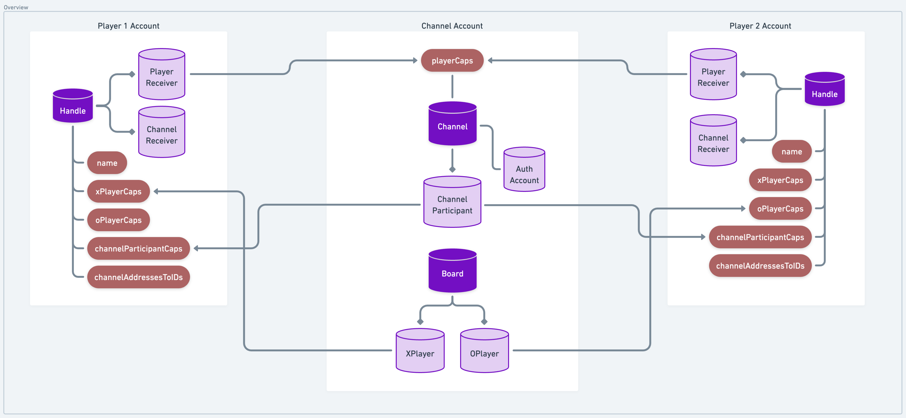

# ❌ Onchain TicTacToe ⭕

<!-- 
- Not clear why channels are necessary
- Needs warning on use of AuthAccount Caps
- Needs explanation of why we made this design choice
- Could this have been done without account caps?
-->

This TicTacToe contract was created to explore Web3-native notions of neutral ground gaming servers commonly found in traditional gaming environments.

One of the fundamental problems in creating trustless onchain multiplayer games is preserving neutrality in a manner that is scalable and resilient to DDOS attacks on the contract account. If two players must to act on game state, where do we store that game state such that neither player has the ability to interfere with the other's gameplay **and** doesn't rely on contract managed storage or funding?

The tension here is created by the fact that a) we want immortally composable game contracts and b) game environments are inherently adversarial. Depending on contract account storage demands someone be around to fund the game's storage, but offloading storage responsibility on players can create unfair advantages.

So what to do?

In TicTacToe, the experimental solution is to introduce neutral ground by creating a new account entirely, and dedicating this account to facilitate gameplay between two players - a "channel", if you will. Access to that neutral account is encapsulated in a contract-defined resource both players have access to, enabling creation and storage of new boards in a trustless manner. Either player can fund account storage, and players are guaranteed funds go only toward funding storage of their games and no one else's.

This approach removes the dependency on contract account storage, aligning incentives for storage use - those that benefit from the storage of relevant resources are tasked with funding it.

These "server" or "channel" accounts showcase how AuthAccount Capabilities can be leveraged to ecapsulate and programmatically utilize account access in use cases more general than HybridCustody.



Each player's access to the game is mediated through a `Handle` which manages Capabilities on both `Channel` and `Board` resources. Whenever a player wants to engage in play with another, they open a new `Channel` which is saved in an encapsulated account. From there, they can instantiate new `Board`s which randomly assign X or O to either player participating in the `Channel`. Gameplay can then occur agains that board according to the well-known rules of Tic-Tac-Toe, continuing until either player wins or all cells are filled.

## Flow CLI Walkthrough

> :information_source: If you haven't already, be sure to [install Flow CLI](https://developers.flow.com/tooling/flow-cli/install)

1. Run the emulator:
    ```sh
    flow emulator
    ```
1. Run the dependency setup script which re-creates the `flow.json` configuration state in emulator, giving us `player1` and `player2` accounts, deploying the `TicTacToe` contract, and funding said accounts with $FLOW:
    ```sh
    sh setup.sh
    ```
1. Set up `Handle` resources in player accounts. The `Handle` is akin to an online gamer identity, but onchain and is the interface through which players engage with open `Channel`s and corresponding `Board`s. We'll set one up for both players:
    ```sh
    flow transactions send transactions/setup_handle.cdc BoardGamer --signer player1
    ```
    ```sh
    flow transactions send transactions/setup_handle.cdc TicTacToad --signer player2
    ```
1. Setup a "channel account" between `player1` and `player2`. Since the channel account needs to be created, we'll also specify an amount of $FLOW to fund the new account. Think of this like the quarter you put into an arcade machine to play a game, except here it funds account storage so we can save `Board`s in the `Channel` account.
    > As mentioned above, a "channel account" can be thought of as a Web3-native game server - a neutral ground that codifies rules of engagement enabling collaborative play in an the inherently adversarial environment of player vs. player games.
    ```sh
    flow transactions send transactions/create_channel_with_player.cdc 179b6b1cb6755e31 1.0 --signer player1
    ```
1. Either player can now setup a new `Board` to play in the channel account. Even though `player1` setup the channel, `player2` can start up a new board between them:
    ```sh
    flow transactions send transactions/start_new_board_with_player.cdc 01cf0e2f2f715450 --signer player2
    ```
1. Remember - X always goes first and assignment is randomized to channel participants on `Board` creation. Players submit moves and continue gameplay (repeat until game is over)
    > Check the `TicTacToe.BoardCreated` event for the `boardID` and `xPlayerAddress` for the first player assignment
    ```sh
    flow transactions send transactions/submit_move_by_board_id.cdc <BOARD_ID> <ROW> <COLUMN> --signer <ACCOUNT_NAME>
    ```
1. At any point throughout gameplay, we can query a player's `Handle` to see which `Board`s  are awaiting their move next (indexed on the participating player's `Address`) with the following script:
    > This is very helpful for local clients to retrieve state after the player has taken a break from playing - they can easily recover board state and show the player their `Board`s in play requiring action
    ```sh
    flow scripts execute scripts/get_next_up_boards_by_channel.cdc <HANDLE_ADDRESS>
    ```