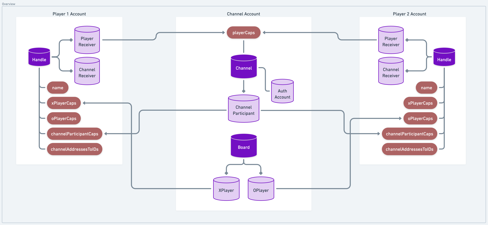

# ❌ Onchain TicTacToe ⭕

<!-- 
- Not clear why channels are necessary
- Needs warning on use of AuthAccount Caps
- Needs explanation of why we made this design choice
- Could this have been done without account caps?
-->

This TicTacToe contract was created to explore Web3-native notions of neutral ground gaming servers commonly found in traditional gaming environments.

One of the fundamental problems in creating trustless onchain multiplayer games is preserving neutrality in a manner that is scalable and resilient to DDOS attacks on the contract account. If two players must to act on game state, where do we store that game state such that neither player has the ability to interfere with the other's gameplay **and** doesn't rely on contract managed storage or funding?

The tension here is created by the fact that a) we want immortally composable game contracts and b) game environments are inherently adversarial. Depending on contract account storage demands someone be around to fund the game's storage, but offloading storage responsibility on players can create unfair advantages.

So what to do?

In TicTacToe, the experimental solution is to introduce neutral ground by creating a new account entirely, and dedicating this account to facilitate gameplay between two players - a "channel", if you will. Access to that neutral account is encapsulated in a contract-defined resource both players have access to, enabling creation and storage of new boards in a trustless manner. Either player can fund account storage, and players are guaranteed funds go only toward funding storage of their games and no one else's.

This approach removes the dependency on contract account storage, aligning incentives for storage use - those that benefit from the storage of relevant resources are tasked with funding it.

These "server" or "channel" accounts showcase how AuthAccount Capabilities can be leveraged to ecapsulate and programmatically utilize account access in use cases more general than HybridCustody.



Each player's access to the game is mediated through a `Handle` which manages Capabilities on both `Channel` and `Board` resources. Whenever a player wants to engage in play with another, they open a new `Channel` which is saved in an encapsulated account. From there, they can instantiate new `Board`s which randomly assign X or O to either player participating in the `Channel`. Gameplay can then occur agains that board according to the well-known rules of Tic-Tac-Toe, continuing until either player wins or all cells are filled.

## Flow CLI Walkthrough

> :information_source: If you haven't already, be sure to [install Flow CLI](https://developers.flow.com/tooling/flow-cli/install)

1. Deploy TicTacToe
    ```sh
    flow emulator start
    ```
    ```sh
    flow deploy
    ```
1. Create player accounts
    ```sh
    flow accounts create # account name: player1
    ```
    ```sh
    flow accounts create # account name: player2
    ```
1.  Configure `Handle` resources in player accounts
    ```sh
    flow transactions send transactions/setup_handle.cdc --signer player1
    ```
    ```sh
    flow transactions send transactions/setup_handle.cdc --signer player2
    ```
1. Transfer $FLOW to `player1` so it can fund the channel
    ```sh
    flow transactions send transactions/transfer_flow.cdc e03daebed8ca0615 10.0
    ```
1. Setup a channel between `player1` and `player2` which also creates a new board in said `Channel` account
    ```sh
    flow transactions send transactions/create_channel_with_player.cdc <PLAYER_TWO_ADDRESS> <FUNDING_AMOUNT> --signer player1
    ```
1. Setup a new `Board` to play in the channel between both players
    ```sh
    flow transactions send transactions/start_new_board_with_player.cdc <PLAYER_TWO_ADDRESS> --signer player1
    ```
1. Submit moves and continue gameplay (repeat until game is over)
    ```sh
    flow transactions send transactions/submit_move_by_board_id.cdc <BOARD_ID> <ROW> <COLUMN> --signer <ACCOUNT_NAME>
    ```